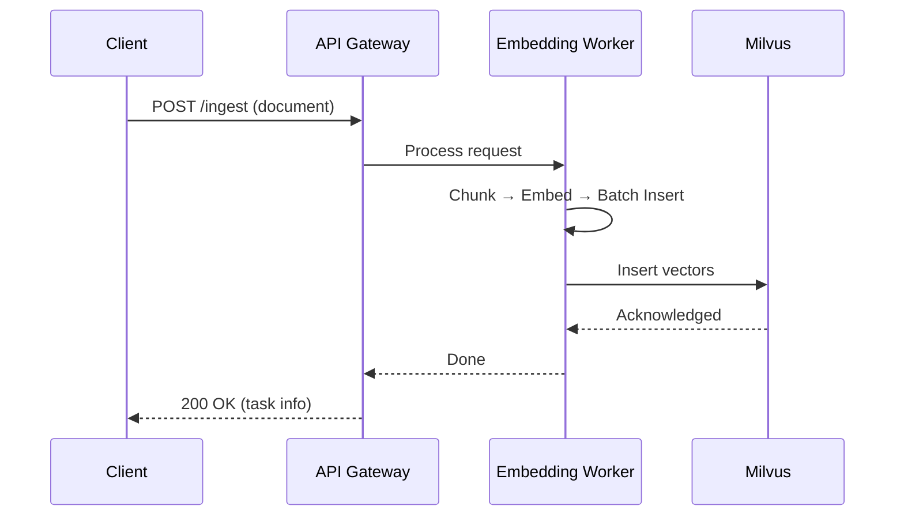
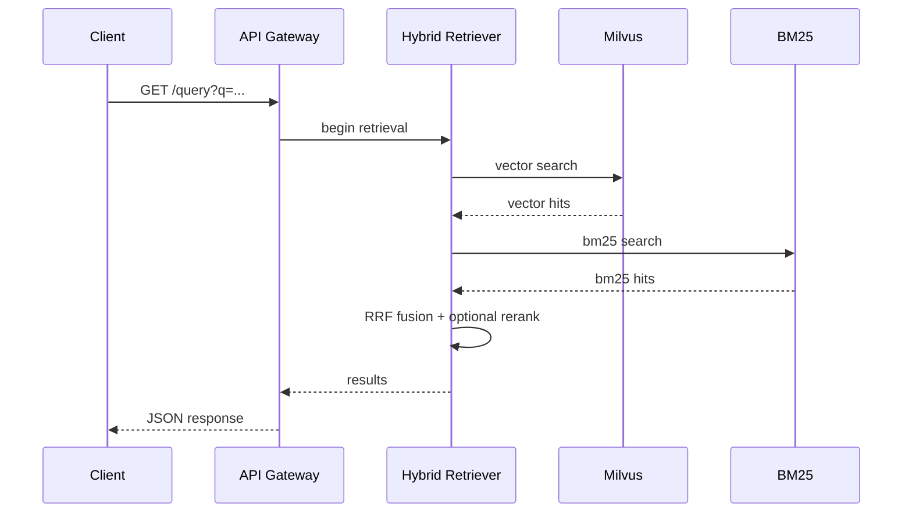

---

# **Enterprise RAG Architecture**

This document describes the architecture of the enterprise-grade Retrieval-Augmented Generation (RAG) system implemented in this repository.
The system supports hybrid retrieval (Vector + BM25), reranking, caching, and batch ingestion using Milvus.

---

## **1. High-Level Architecture**

```mermaid
graph TD
    A[Client Request] -->|POST /ingest| B[API Gateway]

    B --> C[Embedding Worker]
    C -->|Chunk → Embed → Batch Insert| D[(Milvus Vector DB)]

    A2[Client Request] -->|GET /query| E[API Gateway]
    E --> F[Hybrid Retriever]

    subgraph Retrieval Pipeline
        F --> D
        F --> G[BM25 Index]
        F --> H[RRF Fusion]
        H --> I[Rerank (optional)]
    end

    I --> J[Final Response JSON]
```

---

## **2. Component Overview**

### **API Gateway (FastAPI)**

* `/ingest` performs document validation and launches the ingestion pipeline.
* `/query` performs hybrid retrieval + rerank.
* `/health` exposes Milvus status and collection metadata.
* Includes structured logging (trace_id) and caching hooks.

---

### **Embedding Worker**

Handles the heavy lifting in the ingestion path:

1. Chunk text using configurable strategies (char/sentence).
2. Compute deterministic dummy embeddings (pluggable with any real embedding model).
3. Batch insert vectors into Milvus (`batch_size=2000`).
4. Logs timing: chunk_ms / embed_ms / insert_ms / flush_ms.

---

### **Hybrid Retriever**

Combines multiple search signals:

* **Vector Search** (Milvus IVF_FLAT)
* **BM25 Search**
* **RRF Fusion** (Reciprocal Rank Fusion)
* Optional **embedding-based reranking**

Response includes:

* matched chunks
* vector/bm25 scores
* fused score
* latency breakdown (debug mode)

---

### **Milvus Vector Database**

Stores chunk embeddings and metadata.

Schema includes:

| Field    | Description            |
| -------- | ---------------------- |
| id       | auto primary key       |
| vector   | float32[dim] embedding |
| doc_id   | original document ID   |
| chunk_id | chunk index            |
| meta     | JSON metadata          |

Indexes:

* IVF_FLAT (default)
* IVF_SQ8 (optional)

---

### **Redis Cache**

Short-lived query cache (TTL 30–60s):

```
query_hash → cached_result
```

Avoids repeated hybrid retrieval for identical queries.

---

## **3. Ingest Flow**



---

## **4. Query Flow**



---

## **5. Directory Structure**

```
services/
  api_gateway/
  embedding_worker/
  retriever/
libs/
  chunking/
  caching/
  logging/
docker/
infra/
scripts/
tests/
```

---

## **6. Future Extensions**

* Replace dummy embedding with OpenAI/Cohere/SentenceTransformers.
* Add Kafka ingestion pipeline + distributed embedding workers.
* Switch to Milvus Distributed mode.
* Integrate OpenTelemetry tracing.
* Add async ingestion with task queue.
* Add chunk cache to reduce repeated embedding.

---
